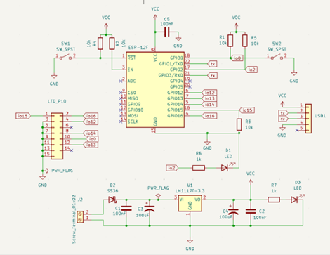

**INTRODUCTION**
Giới thiệu Dự án Hiển thị Nội dung MQTT trên Màn hình LED P10 
bằng ESP8266. 
Trong kỷ nguyên của Internet of Things (IoT), việc kết nối và giao 
tiếp giữa các thiết bị trở nên ngày càng quan trọng và phổ biến. Một trong 
những giao thức truyền thông phổ biến và hiệu quả cho các ứng dụng IoT là 
MQTT (Message Queuing Telemetry Transport). MQTT là một giao thức 
nhẹ và dễ triển khai, giúp các thiết bị IoT truyền tải và nhận dữ liệu một 
cách nhanh chóng và hiệu quả. 
Trong dự án này, chúng ta sẽ triển khai một ứng dụng thực tế sử 
dụng ESP8266 - một module WiFi mạnh mẽ và phổ biến, để kết nối và 
nhận dữ liệu từ một máy chủ MQTT (HiveMQ) và hiển thị nội dung nhận 
được lên một màn hình LED P10. Màn hình LED P10 là một loại màn hình 
ma trận LED phổ biến, thường được sử dụng để hiển thị thông tin trong các 
ứng dụng quảng cáo, thông báo công cộng và nhiều ứng dụng khác.
**SCHEMATIC**
